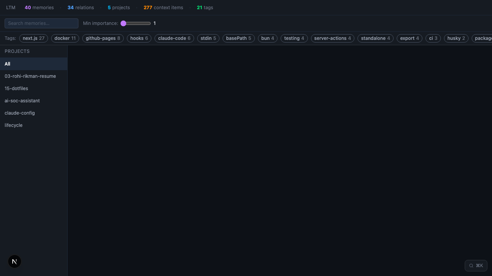

# ~/.claude — Claude Code Global Config

> Personal Claude Code setup by [Rohi Rikman](https://github.com/RohiRIK). Applies to all projects.
> Last updated: 2026-03-09
>
> Inspired by [danielmiessler/Personal\_AI\_Infrastructure](https://github.com/danielmiessler/Personal_AI_Infrastructure) and [affaan-m/everything-claude-code](https://github.com/affaan-m/everything-claude-code).


---

## 3-Layer Architecture

```
                         ~/.claude
                            │
         ┌──────────────────┼──────────────────┐
         │                  │                  │
         ▼                  ▼                  ▼
  ┌─────────────┐   ┌─────────────┐   ┌─────────────────┐
  │   LAYER 1   │   │   LAYER 2   │   │    LAYER 3      │
  │   WORKFLOW  │   │  SHORT-TERM │   │   LONG-TERM     │
  │             │   │   MEMORY    │   │    MEMORY       │
  │ Boris Cherny│   │context-mode │   │ SQLite LTM DB   │
  │  task loop  │   │    MCP      │   │ + graph UI      │
  └──────┬──────┘   └──────┬──────┘   └───────┬─────────┘
         │                  │                  │
         ▼                  ▼                  ▼
  /plan → implement   cmd → subprocess   ltm.db (SQLite)
  → /simplify         → BM25 index       → PreCompact
  → /verify           → summaries        → SessionStart
  → /commit-push-pr   → context          → /learn /recall
                                         → graph UI :7332
         │                  │                  │
         ▼                  ▼                  ▼
  workflow-daily.md  memory-short-term.md  memory-long-term.md
```

> "A good plan is really important. Claude typically 1-shots implementation from a well-formed plan." — Boris Cherny

---

## LTM Graph Visualizer

Obsidian-style memory graph at **http://localhost:7332** (API on :7331).



| Feature | How |
|---------|-----|
| Tag filter panel | Click tag chips → dims non-matching nodes to 15% opacity |
| ⌘K Spotlight search | FTS5-powered; click result → graph zooms to node + opens sidebar |
| Project drill-down | Click project node → `/project/[name]` with radial MiniGraph |

Start it: `/ltm-server` · Stop it: `/ltm-server stop`

---

## Quick-Reference Commands

| Command | When to Use |
|---------|------------|
| `/plan` | **Always first** — before any non-trivial change |
| `/simplify` | After implementation — remove complexity |
| `/verify` | Before committing — tsc + tests + security + diff |
| `/commit-push-pr` | Final step — precomputes git context |
| `/tdd` | New features — writes tests FIRST |
| `/code-review` | After writing code |
| `/init-context` | New project — seeds goal into SQLite LTM |
| `/check-context` | Start of session — verify Claude has the right context |
| `/update-context` | Mid-session — add progress/decisions/gotchas |
| `/register-project` | Register or rename a project in the context registry |
| `/learn` | Store a pattern or insight in LTM |
| `/recall` | Search long-term memory before starting work |
| `/ltm-server` | Start/stop/status the LTM graph UI |
| `/e2e` | Critical user flows — Playwright tests |
| `/build-fix` | When build fails |
| `/refactor-clean` | Remove dead code |
| `/goose` | Spawn parallel autonomous agents |

---

## Non-Negotiables

- **bun** not npm/yarn · **uv** not pip
- Immutability: spread operators, never mutate objects
- No hardcoded secrets — env vars only
- 80% test coverage minimum
- Conventional commits: `feat|fix|refactor|docs|chore: description`
- No `console.log` in committed code
- Long-running commands → tmux

---

## Docs

| Doc | What it covers |
|-----|---------------|
| [docs/workflow-daily.md](docs/workflow-daily.md) | Layer 1: Boris Cherny task loop, commands, agents, hooks |
| [docs/memory-short-term.md](docs/memory-short-term.md) | Layer 2: context-mode MCP — execution memory, tool guide |
| [docs/memory-long-term.md](docs/memory-long-term.md) | Layer 3: SQLite LTM — graph visualizer, commands, hooks |
| [docs/AGENT_ARCHITECTURE.md](docs/AGENT_ARCHITECTURE.md) | Multi-agent system design and orchestration patterns |

---

## About

**Rohi Rikman** — Tech Enthusiast · Cloud Security Engineer · Automation Specialist · Based in Tel Aviv.

[](https://github.com/RohiRIK)
[](https://www.linkedin.com/in/rohi-rikman-48831b239/)
[](https://medium.com/@rohi5054)

> *☕ Powered by caffeine and questionable life choices. ☕*
