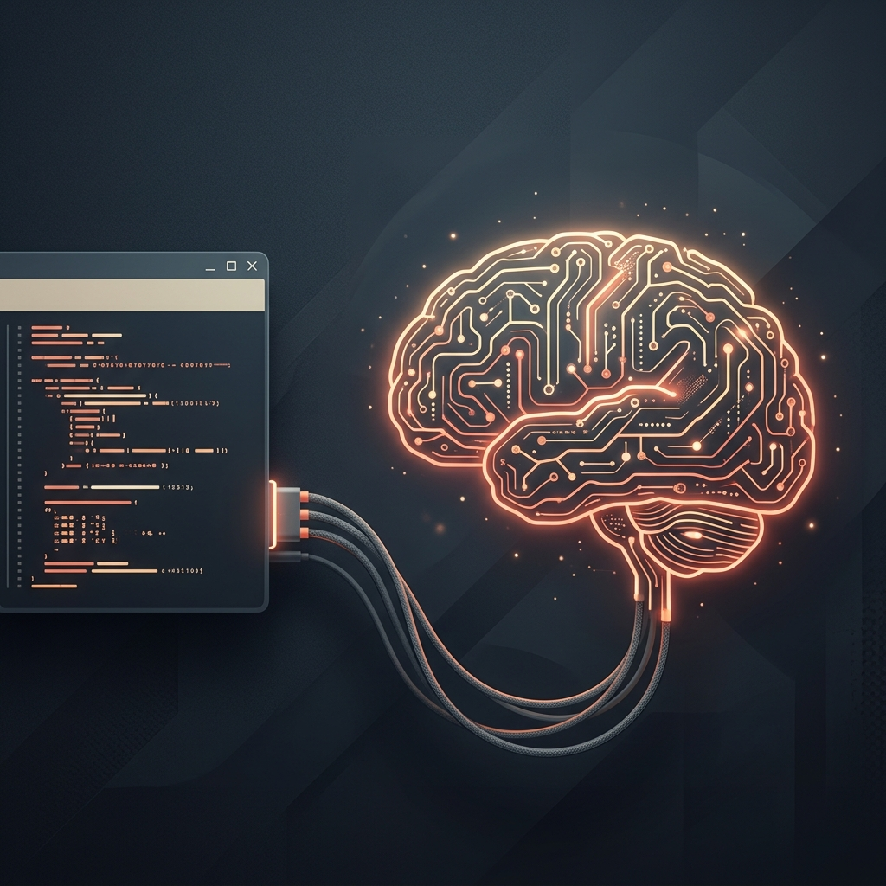

# Agent Architecture

> Claude Code global configuration architecture. Last updated: 2026-03-26



## Ownership Boundary

| This repo (`claude-code-config`) | External repo (`OpenLtm`) |
|----------------------------------|--------------------------------------|
| Agents, skills, hooks, commands, rules | LTM DB, MCP server, REST API, Graph UI |
| Context file management (`context-*.md`) | Janitor pipeline, provider system |
| Hook → LTM integration | Recall / embedding logic |
| Workflow & architecture docs | LTM settings keys reference |

> **LTM internals have moved** → see [`RohiRIK/OpenLtm`](https://github.com/RohiRIK/OpenLtm) and [`docs/LTM_MIGRATION.md`](LTM_MIGRATION.md).

## Overview

This document describes the architecture of the Claude Code agent system — how agents, skills, hooks, and the auditor work together to provide an intelligent, self-maintaining development environment. It covers only what lives in this repository.

---

## High-Level Architecture

```
┌──────────────────────────────────────────────────────────┐
│               USER INTERFACE                             │
│          (Claude Code CLI / IDE Plugin)                  │
└────────────────────────┬─────────────────────────────────┘
                         │
                         ▼
┌──────────────────────────────────────────────────────────┐
│                  SESSION LIFECYCLE                       │
│                                                          │
│  ┌───────────┐  ┌───────────┐  ┌───────────┐  ┌──────┐ │
│  │ Session   │─▶│  Claude   │─▶│PreCompact │─▶│ End  │ │
│  │  Start    │  │  Working  │  │   Hook    │  │      │ │
│  └───────────┘  └───────────┘  └───────────┘  └──────┘ │
│       │               │               │            │     │
│       ▼               ▼               ▼            ▼     │
│  ┌─────────┐  ┌────────────┐  ┌──────────┐  ┌────────┐ │
│  │Context  │  │  Agents    │  │ Context  │  │Evaluate│ │
│  │ Inject  │  │ (on-demand)│  │ Summary  │  │Session │ │
│  └─────────┘  └────────────┘  └──────────┘  └────────┘ │
└──────────────────────────────────────────────────────────┘
                         │
         ┌───────────────┼───────────────┐
         ▼               ▼               ▼
┌────────────────┐ ┌────────────────┐ ┌────────────────┐
│    AGENTS      │ │    SKILLS      │ │    HOOKS       │
│ (Specialists)  │ │  (Tools)       │ │ (Lifecycle)    │
│                │ │                │ │                │
│ - planner      │ │ - Art          │ │ - SessionStart │
│ - architect    │ │ - Goose        │ │ - PreCompact   │
│ - code-reviewer│ │ - Prompting    │ │ - EvaluateSess │
│ - security-rev │ │ - agent-browser│ │ - Cleanup      │
│ - tdd-guide    │ │ - TddWorkflow  │ │ - SuggestCompact│
│ - ...          │ │ - ...          │ │ - ...          │
└────────────────┘ └────────────────┘ └────────────────┘
         │               │               │
         └───────────────┼───────────────┘
                         ▼
┌──────────────────────────────────────────────────────────┐
│                     AUDITOR                              │
│              (Dual-AI Security Audit)                    │
│                                                          │
│  ┌──────────────┐         ┌──────────────┐              │
│  │  Gemini 3    │         │  Gemini 3    │              │
│  │    Flash     │────────▶│     Pro      │──▶ Findings  │
│  │ (fast check) │         │ (deep audit) │              │
│  └──────────────┘         └──────────────┘              │
└──────────────────────────────────────────────────────────┘
```

---

## Component Types

### Agents
Specialized AI specialists invoked for specific tasks. Each agent has a focused role:

| Agent | Purpose | Model |
|-------|---------|-------|
| `planner` | Create implementation plans | opus |
| `architect` | System design decisions | opus |
| `build-error-resolver` | Fix TypeScript/build errors | opus |
| `code-reviewer` | Code quality review | opus |
| `code-simplifier` | Remove unnecessary complexity | opus |
| `database-reviewer` | PostgreSQL/Supabase review | sonnet |
| `doc-updater` | Documentation generation | opus |
| `e2e-runner` | Playwright E2E tests | opus |
| `python-reviewer` | Python code review | sonnet |
| `refactor-cleaner` | Dead code removal | opus |
| `security-reviewer` | Security vulnerability detection | opus |
| `tdd-guide` | Test-driven development | opus |

**Invocation:** Agents are invoked by slash commands or automatically by Claude when relevant.

---

### Skills
Modular tool systems that provide capabilities. Skills contain workflows and tools:

| Skill | Purpose |
|-------|---------|
| `Art` | Visual content generation (diagrams, illustrations) |
| `Blogging` | Blog post creation and formatting |
| `CodingStandards` | Language-specific coding standards (TS, Python, Bash, PS, Swift, Rust) |
| `ContentWriter` | Blog/LinkedIn/X content |
| `ContinuousLearning` | Memory persistence |
| `CreateSkill` | Skill creation framework |
| `BackendDesign` | API/database patterns |
| `FrontendDesign` | React/UI patterns |
| `Goose` | Parallel agent orchestration |
| `Learned` | Captured patterns and gotchas |
| `LtmServer` | LTM server integration helpers |
| `M365AgentsToolkit` | Microsoft 365 agents development |
| `Prompting` | Prompt engineering templates |
| `SecurityReview` | Security audit checklists |
| `Simplify` | Code simplification workflows |
| `StrategicCompact` | Context management |
| `TddWorkflow` | Test-driven development orchestration |
| `agent-browser` | Browser automation |
| `docker-patterns` | Docker best practices |

**Invocation:** Skills are invoked via the Skill tool when user requests match skill triggers.

---

### Hooks
Lifecycle-triggered scripts that run at specific events:

| Hook | Trigger | Purpose |
|------|---------|---------|
| `SessionStart` | Session begins | Inject project context |
| `PreCompact` | Before compaction | Assemble context summary |
| `EvaluateSession` | Session ends | Extract learning patterns |
| `Cleanup` | Session ends | Trim context files |
| `SuggestCompact` | Every ~50 tools | Suggest compaction |
| `SessionAutoName` | First prompt | Set terminal tab title |
| `SkillGuard` | Skill invocation | Prevent false triggers |
| `UpdateContext` | Session end | Update progress |

**Invocation:** Hooks run automatically based on Claude Code events.

---

### Auditor
External security audit system using dual AI models:

- **Gemini 3 Flash Preview**: Fast line-level checks (~30-60s)
- **Gemini 3 Pro Preview**: Deep adversarial analysis (~60-150s)

**Invocation:** Run via `/audit` command or manually.

---

## Execution Flows

### Flow 1: User Invokes Agent

```
User: /plan add authentication
        │
        ▼
Claude Code recognizes /plan command
        │
        ▼
Invokes planner agent
        │
        ▼
Agent analyzes, creates plan, waits for confirmation
        │
        ▼
User confirms "yes"
        │
        ▼
Claude implements plan
```

### Flow 2: Skill Invoked

```
User: "create a diagram showing the flow"
        │
        ▼
Claude identifies "Art" skill trigger
        │
        ▼
Loads Art skill
        │
        ▼
Routes to "TechnicalDiagrams" workflow
        │
        ▼
Executes skill tools, generates image
```

### Flow 3: Hook Lifecycle

```
1. Session Start
   User opens project in Claude Code
        │
        ▼
   SessionStart hook fires
        │
        ▼
   Reads ~/.claude/projects/<name>/context-summary.md (registry lookup)
        │
        ▼
   Injects context into Claude's prompt

2. During Session
   Claude maintains context files
   (goals, decisions, progress, gotchas)

3. Pre-Compact
   Context window filling up
        │
        ▼
   PreCompact hook fires
        │
        ▼
   Assembles 4 context files → context-summary.md

4. Session End
   User stops session
        │
        ▼
   EvaluateSession hook → saves patterns
   Cleanup hook → trims old data
```

---

## Directory Structure

```
~/.claude/
├── agents/                    # Agent definitions (see agents/ folder for full list)
│   ├── planner.md
│   ├── architect.md
│   ├── code-simplifier.md
│   └── ...
├── skills/                    # Skill definitions (see skills/ folder for full list)
│   ├── Art/
│   │   ├── SKILL.md
│   │   ├── Workflows/
│   │   └── Tools/
│   ├── CodingStandards/
│   ├── Goose/
│   └── ...
├── hooks/                    # Lifecycle hooks
│   ├── SessionStart/
│   ├── PreCompact/
│   ├── EvaluateSession/
│   └── ...
├── projects/                 # Per-project context
│   ├── registry.json         # path → friendly name map
│   └── <name>/               # e.g. my-app, claude-config
│       ├── context-summary.md
│       ├── context-goals.md
│       └── ...
├── rules/                    # Claude Code rules
├── settings.json             # Hooks configuration
└── docs/                    # This documentation
    ├── AGENT_ARCHITECTURE.md
    ├── LTM_MIGRATION.md      # LTM ownership / migration
    ├── agents/
    ├── skills/
    ├── hooks/
    └── auditor/
```

---

## Context System

The context system persists knowledge across sessions:

```
~/.claude/projects/<name>/   # friendly name from registry.json
├── context-summary.md    # Injected at session start (60 lines max)
├── context-goals.md      # Current goal (1-3 lines)
├── context-decisions.md  # Architectural decisions (permanent)
├── context-progress.md   # Completed tasks (trimmed to 20 items)
└── context-gotchas.md   # Warnings/blockers (permanent)
```

**Name resolution:** registry.json exact match → prefix match → slug fallback. Use `/register-project` to register, `/check-context` to verify.

---

## Related Documentation

- [LTM Migration](LTM_MIGRATION.md) - Ownership boundary and what moved to `OpenLtm`
- [Agents](agents/) - Detailed agent documentation
- [Skills](skills/) - Skill reference and workflows
- [Hooks](hooks/) - Lifecycle hook documentation
- [Auditor](auditor/) - Security audit system

---

## Contributing

This architecture evolves with the system. When adding new:
- **Agents**: Add to `agents/` and reference in docs/agents/
- **Skills**: Create in `skills/` with SKILL.md
- **Hooks**: Add to `hooks/` and document in docs/hooks/
- **Update this file**: Maintain the architecture overview
