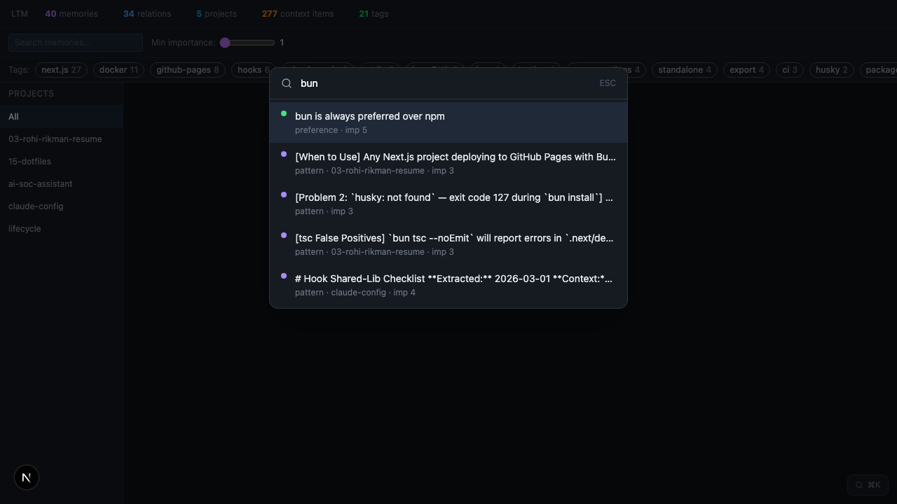
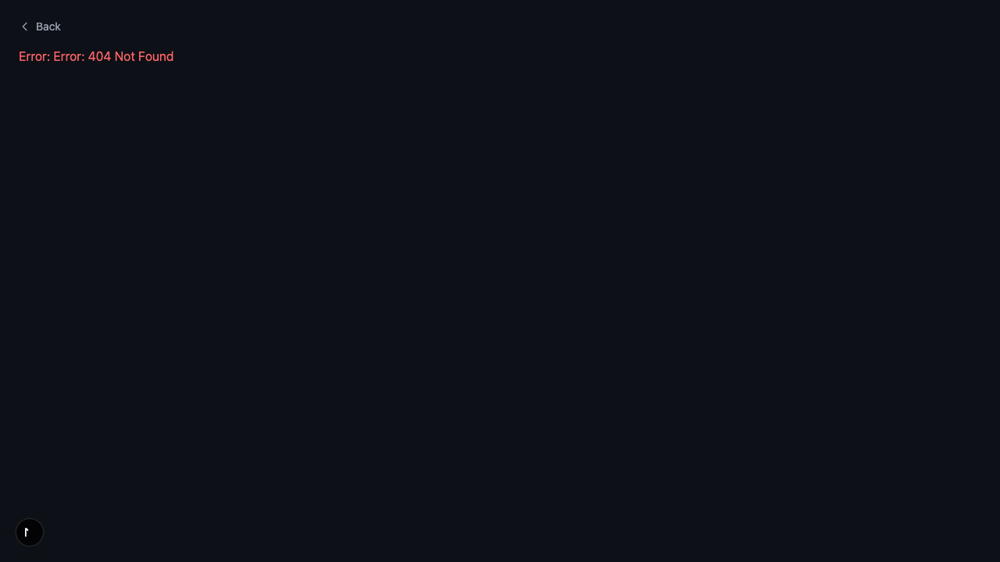

# Long-Term Memory (Layer 3)

> SQLite-backed LTM at `~/.claude/memory/ltm.db`. Hooks manage reads/writes automatically.
> Last updated: 2026-03-09

---

## Overview

Layer 3 has two sub-systems that work together:

```
  ┌─────────────────────────────────────────────────────┐
  │               LONG-TERM MEMORY (Layer 3)            │
  │                                                     │
  │  ┌──────────────────┐   ┌──────────────────────┐   │
  │  │  SESSION CONTEXT │   │   LEARNING LOOP      │   │
  │  │                  │   │                      │   │
  │  │  per-project     │   │  global memories     │   │
  │  │  goal / decision │   │  patterns / gotchas  │   │
  │  │  progress/gotcha │   │  preferences         │   │
  │  └────────┬─────────┘   └──────────┬───────────┘   │
  │           │                        │               │
  │           ▼                        ▼               │
  │     context_items             memories             │
  │     (project-scoped)          (global + scoped)    │
  │           │                        │               │
  │           └───────────┬────────────┘               │
  │                       ▼                            │
  │              ltm.db  (SQLite)                      │
  │                       │                            │
  │          ┌────────────┴────────────┐               │
  │          ▼                         ▼               │
  │   SessionStart hook          Graph UI :7332        │
  │   (injects context)          (visualize + explore) │
  └─────────────────────────────────────────────────────┘
```

---

## SQLite Schema

| Table | Purpose |
|-------|---------|
| `memories` | Global learned insights with importance/confidence/tags |
| `context_items` | Per-project goals, decisions, progress, gotchas |
| `memory_relations` | Links between memories (supports, contradicts, etc.) |
| `tags` + `memory_tags` | Tag taxonomy for memories |
| `memories_fts` | FTS5 index for full-text search |
| `projects` | Registry of known project names |

---

## Session Context Loop

```
  Session starts
       │
       ▼
  SessionStart hook
  ├─ resolves project from registry.json
  ├─ regenerates context-summary.md from DB
  └─ injects up to 60 lines into session
       │
       ▼
  You work…
       │
       ▼
  /update-context (mid-session)   ← explicit adds
  UpdateContext hook (session end) ← auto-extracted
       │
       ▼
  PreCompact hook
  ├─ writes context-summary.md fallback
  └─ DB survives compaction intact
```

### The 4 Context Types

| Type | Purpose | Trimmed? |
|------|---------|---------|
| `goal` | Current objective (1-3 lines) | Replaced on change |
| `decision` | Architectural choices | Never — permanent |
| `progress` | Session log — what was done | Last 20 kept |
| `gotcha` | Warnings, blockers, pitfalls | Never — permanent |

---

## Learning Loop

```
  Discover insight
       │
       ▼
  /learn "content" --category pattern --importance 4
       │
       ▼
  memories table (ltm.db)
  ├─ dedup_key prevents duplicates
  ├─ confirm_count increments on re-discovery
  └─ importance 5 = injects into every session
       │
       ▼
  /recall [query]        ← FTS5 search before starting work
  /relate <src> <tgt>    ← link related memories
  /forget <id>           ← remove stale memory
```

---

## LTM Graph Visualizer

**Start:** `/ltm-server` · **URL:** http://localhost:7332 · **API:** http://localhost:7331


### Features

**Tag filter panel** — click tag chips to dim non-matching nodes to 15% opacity.

**⌘K Spotlight search** — FTS5-powered modal; click result → graph zooms to node + opens sidebar.



**Project drill-down** — click any project node → dedicated page with radial MiniGraph, context sections, memory cards.



### Architecture

| Component | Location | Port |
|-----------|----------|------|
| API server | `memory/server.ts` (Bun.serve) | :7331 |
| Graph UI | `memory/graph-app/` (Next.js 15) | :7332 |
| WebSocket live-reload | Built into server.ts | :7331 |

### API Routes

| Route | Returns |
|-------|---------|
| `GET /api/graph` | All nodes + links for D3 |
| `GET /api/stats` | Counts by category/project |
| `GET /api/tags` | Tags with memory counts |
| `GET /api/memory/:id` | Memory detail + relations |
| `GET /api/search?q=` | FTS5 search results |
| `GET /api/context/:project` | Context items grouped by type |
| `GET /api/project/:name` | Full project detail (memories + context + relations) |
| `POST /api/reload` | Trigger WS broadcast |

---

## Commands

| Command | When to use |
|---------|------------|
| `/init-context` | New project — seed goal into DB |
| `/update-context goal "…"` | Change current objective |
| `/update-context decision "…"` | Save architectural choice |
| `/update-context gotcha "…"` | Save a warning/pitfall |
| `/update-context progress "…"` | Mid-session explicit progress |
| `/check-context` | Verify Claude has right context |
| `/learn "…"` | Store reusable insight in LTM |
| `/recall [query]` | Search LTM before starting work |
| `/forget <id>` | Remove stale memory |
| `/relate <src> <tgt> <type>` | Link two memories |
| `/ltm-server` | Start/stop/status graph UI |

---

## Hooks

| Hook | Trigger | Action |
|------|---------|--------|
| `SessionStart` | Session opens | Injects 60 lines of context + LTM memories |
| `UpdateContext` | Session ends (Stop) | Extracts progress/decisions/gotchas from session |
| `EvaluateSession` | Session ends | Runs pattern extraction; saves to `memories` |
| `PreCompact` | Before compaction | Writes `context-summary.md` fallback |
| `Cleanup` | Session ends | Trims progress to last 20; removes stale items |
| `NotifyLtmServer` | After any hook write | Broadcasts WS refresh to graph UI |

---

## Promoting to Global LTM

Context items survive 14 days of inactivity per project. For lessons that must persist globally:

```bash
/learn "⚠ Always enable Supabase RLS before production" --category gotcha --importance 5
```

`importance=5` memories inject into **every** session regardless of project.
